# Galaxy Buds Pro - Analysis & Disassembly

Disassembly and analysis of pre-release APK files found on Samsung's servers (as of December 19th 2020)

## Galaxy Buds Pro (Plugin) App

I found this APK while searching through Samsung's Galaxy Store servers. You can find the APK of the plugin in the XML response of this request: https://vas.samsungapps.com/stub/stubDownload.as?appId=com.samsung.accessory.atticmgr&deviceId=SM-G950F&mcc=262&mnc=03&csc=DBT&sdkVer=28&pd=1&systemId=0000000000000&callerId=com.samsung.android.app.watchmanager&abiType=64&extuk=000000000000000

### In-App Screenshots

| Home                                | Home                                        |
| ----------------------------------- | ------------------------------------------- |
| 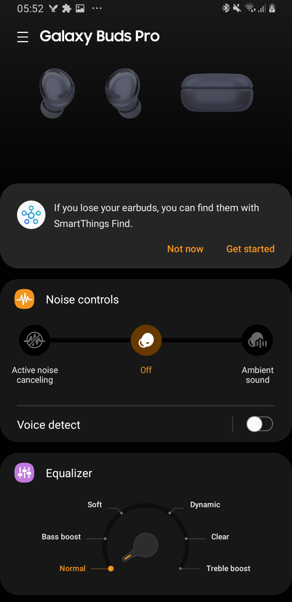       | 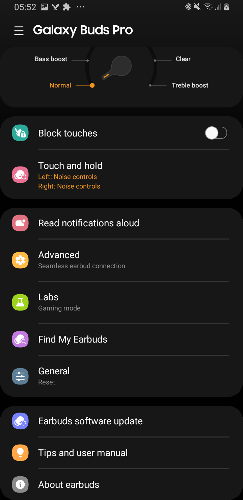             |
| 3D Audio                            | Voice Detect                                |
| 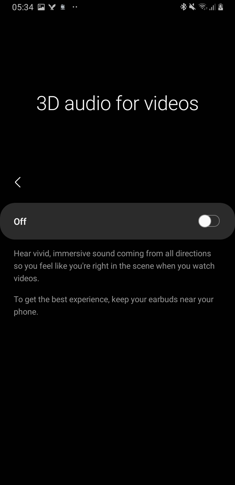 | 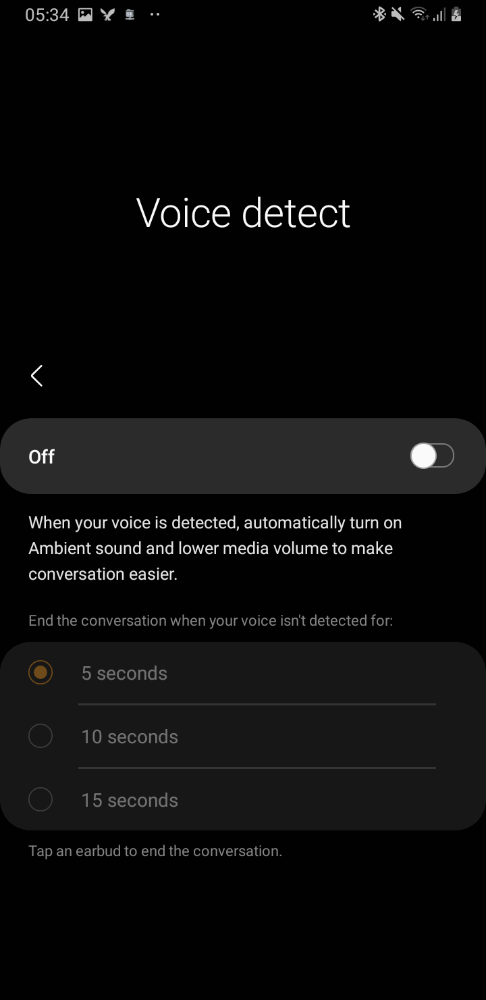 |
| Hearing enhancements (L/R-balance)  | Find my Buds                                |
| 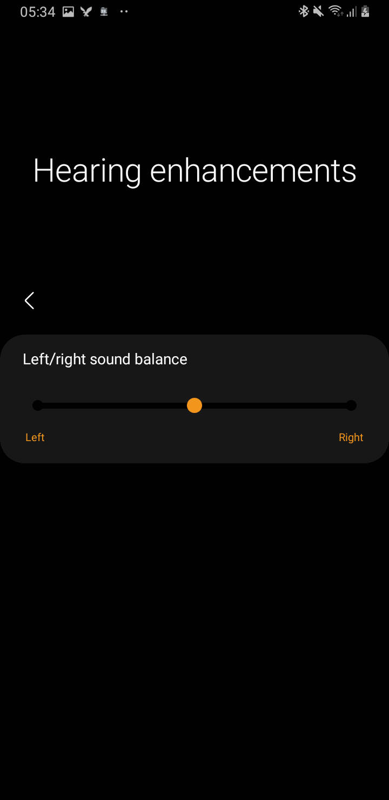 | 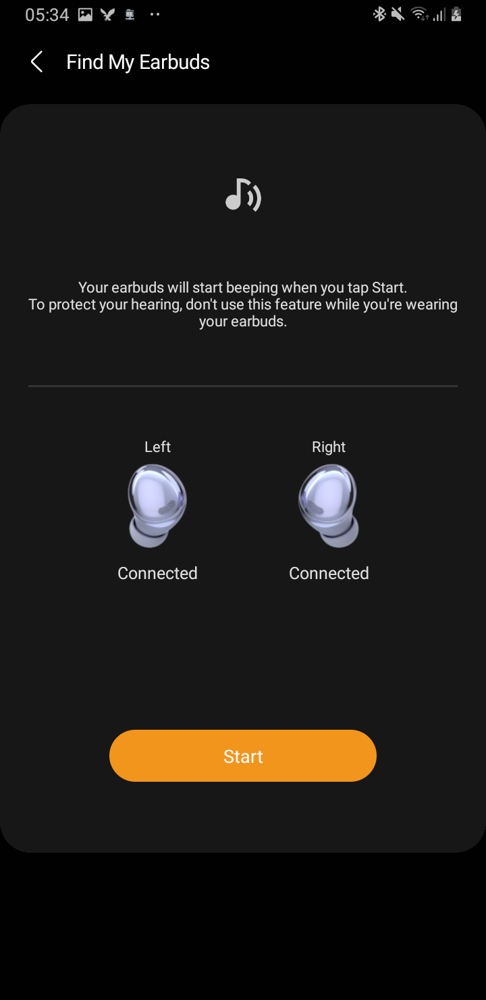                 |

### Video/Screencapture

You can find a video of the interface here: https://streamable.com/1mu6vm

### New Features

* Spatial 3D Audio processor with head tracking
* Voice/conversation detection: turn volume automatically down when the earbuds detect a conversation
* Left/right hearing adjustment
* Noise controls
  * Ambient sound mode
  * ANC mode
* Bixby voice wake-up sensor

### 3D spatial audio

This is a bit disappointing because the 3D audio feature is only available under certain circumstances:

* **Android 11 Samsung device with OneUI required**
* The device requires some certain "sensors" (not sure which ones, it references sensor id 4 and 15; according to internal method names maybe compass sensors)
* The device must support this feature: `SEC_FLOATING_FEATURE_AUDIO_SUPPORT_HEADTRACKING_EFFECT`

When enabled, the Android device enables "headtracking" in Dolby Atmos and sends regularly keep-alive messages to the earbuds. It also enables spatial sound using SoundAlive on the Android device. 

Even though the spatial sound is processed on the Android device, the earbuds transmit data from their gyroscopic sensors. This is very likely used for the headtracking effect and influences the spatial audio effect processor on the phone.

These are all related message ids used for data exchanges related to 3D Audio:

```
protected static final byte SPATIAL_AUDIO_CONTROL = -61;
protected static final byte SPATIAL_AUDIO_CONTROL_ADD = 0;
protected static final byte SPATIAL_AUDIO_CONTROL_ADD_SUCCESS = 2;
protected static final byte SPATIAL_AUDIO_CONTROL_ALIVE = 4;
protected static final byte SPATIAL_AUDIO_CONTROL_REMOVE = 1;
protected static final byte SPATIAL_AUDIO_CONTROL_REMOVE_SUCCESS = 3;
protected static final byte SPATIAL_AUDIO_CONTROL_REQUEST_WEAR = 5;
protected static final byte SPATIAL_AUDIO_DATA = -62;
protected static final byte SPATIAL_AUDIO_DATA_BUD_GRV = 32;
protected static final byte SPATIAL_AUDIO_DATA_BUD_GYROCAL = 35;
protected static final byte SPATIAL_AUDIO_DATA_BUD_SENSOR_STUCK = 36;
protected static final byte SPATIAL_AUDIO_DATA_WEAR_OFF = 34;
protected static final byte SPATIAL_AUDIO_DATA_WEAR_ON = 33;
```

Internally, the Java package for this feature is called `com.samsung.sht.ShtCoreImpl`. You can check it out in the disassembly attached to this repository.

### Hearing enhancements

This setting can adjust the left/right volume balance of the earbuds . Because everything is handled by the earbuds, this setting will persist when connected to another Bluetooth host. However, currently this option is hidden by default.

### Conversation detection

When your voice is detected, automatically turn on Ambient sound and lower media volume to make conversation easier. You can set a timeout to end a detected conversation when your voice isn\'t detected anymore for 5/10/15 seconds. You can also tap an earbud to end a conversation.

### Noise controls

The Buds Pro have ANC and ambient sound onboard. You can only enable one at a time obviously.

When in ambient sound mode, you can choose from four volume settings, and while in ANC mode you can switch between a high and low noise canceling level.

### Bixby integration

Apart from the integration features known from the other models, the Buds Pro's conversation detect and noise control feature can now also be controlled by Bixby.

### Future online manual

You can find the online manual here (not yet released at time of writing):
<https://www.samsung.com/m-manual/mod/SM-R190/>
or here:
<https://www.samsung.com/m-manual/mod/SM-R190/nos/>

These links may not work properly on Desktops with large screens and may redirect you to a blank page or error page. Use a phone instead if you experience these problems.

### Widget

| Battery                                                      | Quick actions                                                |
| ------------------------------------------------------------ | ------------------------------------------------------------ |
| 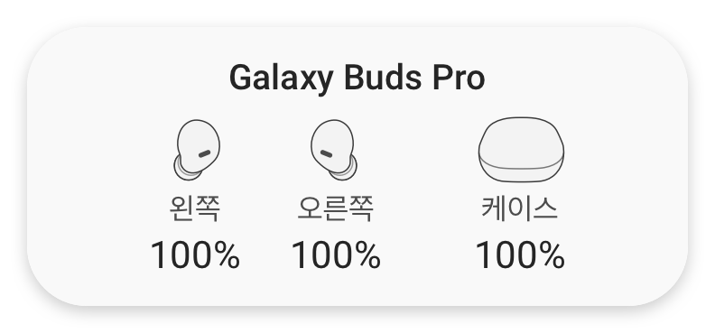 | 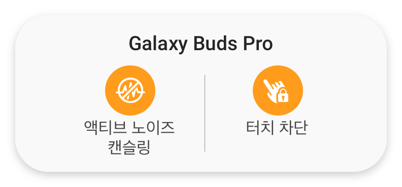 |

### Other image resources

| Earbuds                                                      | Cradle                                                       |
| ------------------------------------------------------------ | ------------------------------------------------------------ |
|  |  |
|  |  |
| 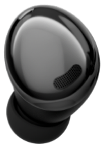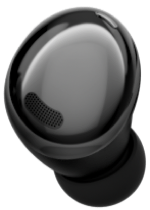 | 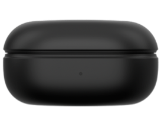 |

### New Bluetooth message definitions

The manager app communicates with the earbuds over a serial Bluetooth RFCOMM connection and exchanges proprietary encoded messages. There was some new interesting stuff added:

* `AgingTestReport`: self-explanatory
* `MeteringReport`: contains the usage time of the earbuds, ambient sound and ANC. All collected data is sent to Samsung's Analytics API
* `NoiseControls`: set/get noice control status
* `NoiseReductionLevel`: self-explanatory
* `UniversalAcknowledgement`: wrapper around several other messages
* `SetDetectConversations`: enable/disable new voice detection 
* `SetDetectConversationsDuration`: reset volume if your voice was not detected for `x` seconds  
* `SetSpatialAudio`: enable/disable 3D spatial audio; other spatial audio message definitions were explained above 

## Galaxy Wearable App

New entry in rules.xml:
```xml
<module-info pluginName="com.samsung.accessory.atticmgr" pluginAppName="Galaxy Buds Pro">
    <devices>
        <group name="Galaxy Buds Pro" wearableType="earbud">
            <item connectAudio="true" hostMinMemory="0" icon="oobe_drawer_ic_buds_pro" supportMultiConnection="true" supportNonSamsung="true" supportTablet="true" switchGearTitleIcon="gm_ab_logo_buds_pro">Galaxy Buds Pro</item>
        </group>
    </devices>
</module-info>
```

Referenced icons (white; hard to recognize):

|  |  |
| ------------------------------------------------------------ | ------------------------------------------------------------ |
| oobe_drawer_ic_buds_pro                                      | gm_ab_logo_buds_pro                                          |


